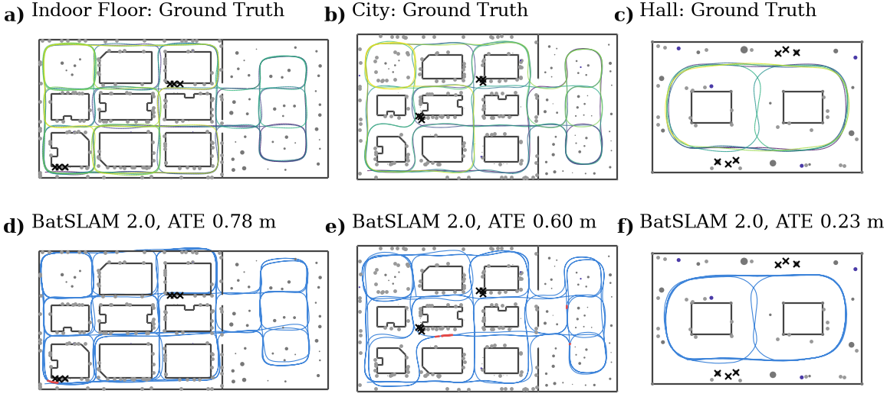
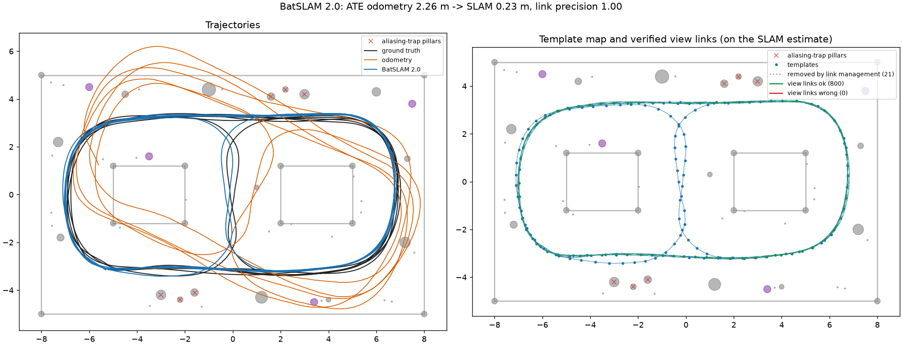

# BatSLAM 2.0

**Sonar-only SLAM for a robot with a bio-inspired binaural sonar.**

BatSLAM 2.0 builds a map from nothing but echoes and odometry. Each pulse of the sonar gives a binaural
echo; the robot turns it into a cochleogram, the kind of time-frequency image a bat's inner ear would
produce, and recognizes places it has visited before by comparing these images. Because places that look
(or rather, sound) alike are common, a single match is never trusted. A loop closure is only accepted
after a whole *sequence* of consistent matches, and the pose graph keeps checking the accepted ones
afterwards.

This repository contains the Python implementation, the MATLAB simulator that renders the datasets,
and the experiment definitions of the paper.



*The three simulated worlds of the paper: an indoor floor, a city and a hall. Top: the ground-truth drive
(colored from start to end). Bottom: the trajectory estimated by BatSLAM 2.0 from the echoes and
odometry alone.*

## How it works

```
 echo (left, right) ──► front-end ──► templates ──► sequence verifier ──► pose graph ──► map
                        cochleogram   place memory   loop-closure         iSAM2 + link
                        E and S       on graph nodes hypotheses           management
```

1. **Front-end** (`batslam/frontend/`). A matched filter, a 64-band filterbank (30–90 kHz) and a
   time-varying gain turn each echo into two images per ear: the *energy* image $E$ (where the echoes
   are) and the *spectral-shape* image $S$ (how the ears colored them, a direction cue). Both use
   32 bands and 6 cm range bins.
2. **Templates** (`batslam/views/`). Every 45 cm (or after a turn), the current view is stored as a
   template, attached to a node of the pose graph. New views are compared with old templates using a
   correlation coefficient, allowing a small range shift.
3. **Sequence verifier** (`batslam/recognition/`). Candidate matches grow into hypotheses ("the stretch I
   am driving now is the stretch I drove then"). A hypothesis is committed only when it is long enough,
   strong enough, clearly better than any inconsistent rival, and geometrically plausible. A commit that
   would move the map a lot must be longer and stronger.
4. **Pose graph** (`batslam/backend/`). GTSAM iSAM2 with odometry factors and the committed links as
   groups of robust constraints. Groups that stay short are withdrawn for good, and a periodic
   robust audit re-checks all of them.

Every parameter, with its default and a comment, is in [`batslam/config.py`](batslam/config.py).

## Installation

The code needs Python 3.11 and GTSAM 4.2 (from conda-forge):

```bash
conda env create -f environment.yml
conda activate batslam2
python -m pytest -q tests          # unit tests, no data needed
```

The results of the paper were produced with Python 3.11.16, GTSAM 4.2.0, NumPy 2.4.6, SciPy 1.17.1 and
Matplotlib 3.11.2. The simulator needs MATLAB (tested with R2026a). The Parallel Computing Toolbox speeds up rendering but
is optional.

## Quickstart: the hall

Render the small hall dataset (1268 pulses, about a minute with a parallel pool) and run BatSLAM 2.0 on
it (about 40 s):

```bash
cd sim
matlab -batch "generate_dataset"
cd ..
python scripts/run_batslam.py --dataset hall.mat --odom-bias 0 --out results/hall
```

`--odom-bias 0` redraws the odometry without its systematic heading bias ("calibrated odometry", as in
the main experiments of the paper). The run prints its metrics, and writes them to
`results/hall/summary.json` together with the trajectories and this map:



On the hall, the absolute trajectory error drops from 2.26 m (odometry) to 0.23 m, with 800 view links,
all correct.

## Reproducing the experiments of the paper

```bash
cd sim
matlab -batch "make_paper_datasets"            # all 8 datasets, into data/ (about 5 GB)
cd ..
python scripts/run_suite.py experiments/main.json          --out results/main          --workers 8
python scripts/run_suite.py experiments/robustness.json    --out results/robustness    --workers 8
python scripts/run_suite.py experiments/ablation.json      --out results/ablation      --workers 8
python scripts/run_suite.py experiments/ablation_hard.json --out results/ablation_hard --workers 8
```

| Experiment file | Runs | What it contains |
|---|---|---|
| `main.json` | 20 | The complete system on every world and route, with calibrated (b = 0), residual (b = 0.25) and uncalibrated (b = 1) odometry, and on the degraded sensors |
| `robustness.json` | 14 | Odometry heading bias from 0 to 2, three times the odometry noise, degraded sensors |
| `ablation.json` | 64 | 16 variants (each safeguard and front-end choice switched off in turn) × 4 standard cases |
| `ablation_hard.json` | 24 | The safeguard variants on the 4 hard cases (degraded sensors, a hard seed) |

A 1 km run takes about 14 minutes on one core; `--workers` runs that many in parallel. `--only <name>`
runs single entries. Each run writes `summary.json` (all metrics), `links.npz` (trajectories and every
link with its ground-truth verdict) and two plots, and each experiment a `table.md` with one row per run.
`python scripts/compare_suites.py results/A results/B` compares the runs of the same name in two result
folders, for example after changing a parameter.

## Using the code

```python
from batslam.config import BatSLAMConfig
from batslam.dataset import load_dataset
from batslam.eval.metrics import summarize
from batslam.frontend.cochleogram import compute_all
from batslam.slam import run

cfg = BatSLAMConfig()                                   # the defaults of the paper
ds = load_dataset("data/hall.mat")
D, _ = compute_all(ds, cfg.frontend)                    # descriptors of all pulses
res = run(ds, D, cfg, cfg.frontend.range_bin)           # the SLAM loop
print(summarize(res, ds, cfg)["ate_slam"])              # res.poses: [N x 3] estimated trajectory
```

Configurations can be changed in code or through a JSON file with partial overrides, for example
`{"recognition": {"min_pairs": 12}, "graph": {"link_management": false}}`, passed with `--config`.

### Dataset format

A dataset is a MATLAB v7 `.mat` file with, for N pulses:

| Field | Content |
|---|---|
| `gt_pose` | [N × 3] ground-truth pose x, y (m), heading (rad) |
| `gt_delta`, `odom_delta` | [N−1 × 3] true and measured odometry increments in the body frame |
| `t`, `lap` | [N] time stamps and route segment index |
| `echo_left`, `echo_right`, `echo_scale` | [N × L] int16 echoes; row i times `echo_scale(i)` gives the signal |
| `meta` | sample rate `fs`, `speed_of_sound`, the emitted `call`, `max_range`, the odometry noise model, `lap_names` |
| `reflectors` | the world, only used for plots |

Recordings from a real sensor can be converted into this format and run as they are (see the paper for
the real-world experiment).

## Repository layout

| Folder | Content |
|---|---|
| `batslam/` | The implementation: front-end, templates, sequence verifier, pose graph, the SLAM loop, metrics and plots |
| `sim/` | The MATLAB simulator and the worlds and routes (see [sim/README.md](sim/README.md)) |
| `experiments/` | The experiment definitions of the paper |
| `scripts/` | Command-line tools to run one dataset or a whole experiment |
| `tests/` | Unit tests of the building blocks |
| `data/` | Datasets (generated, not in the repository) |

## Citation

If you use this code, or results obtained with it, please cite the paper:

```bibtex
@article{batslam2,
  author  = {Steckel, Jan and others},   % TODO: full author list
  title   = {BatSLAM 2.0},               % TODO: final title
  journal = {IEEE Transactions on Robotics},
  year    = {2026},
  note    = {Submitted}
}
```

GitHub's "Cite this repository" button (from [CITATION.cff](CITATION.cff)) gives the reference to the code
itself.

## License

BatSLAM 2.0 is released under the [Apache License 2.0](LICENSE), © 2026 Cosys-Lab. You are free to use,
modify and redistribute it, also commercially. When you redistribute it or a derivative of it, the
license asks you to include the [NOTICE](NOTICE) file and to mark the files you changed.

The head-related transfer function of *Phyllostomus discolor* in `sim/simulator/data/` is from
De Mey et al. (2008).
